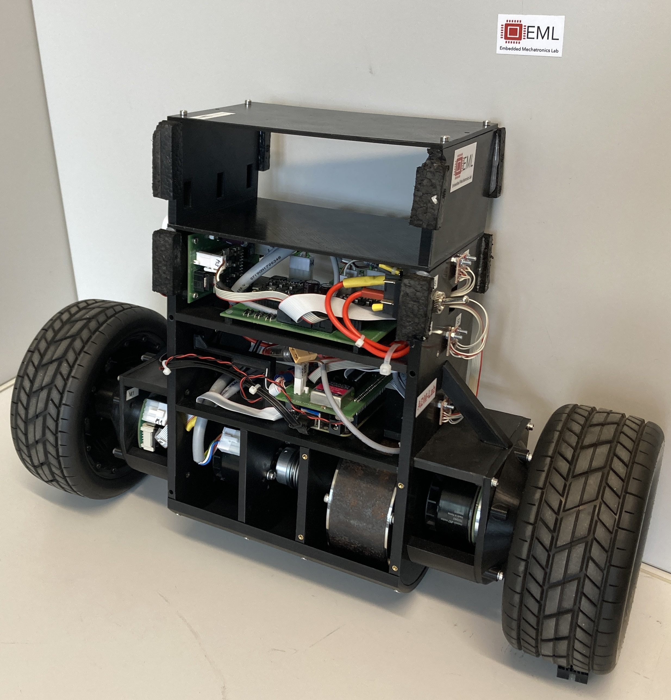

## Welcome to the Challenging Bot Project! What is this project about? 

- Open Source robotic test-bed for artificial motion learning developed in University of Applied Science in Karlsruhe
- low-cost, easy-to-use, easy-to-build
- Explanation of modelling, mechatronic design, feedback control, motion planning via RRT, motion learning via ILC
- all files attached!
  - CAD files, EAGLE files, list of components

## can i include pictures? 

original content 

test

relative path navigation to root

