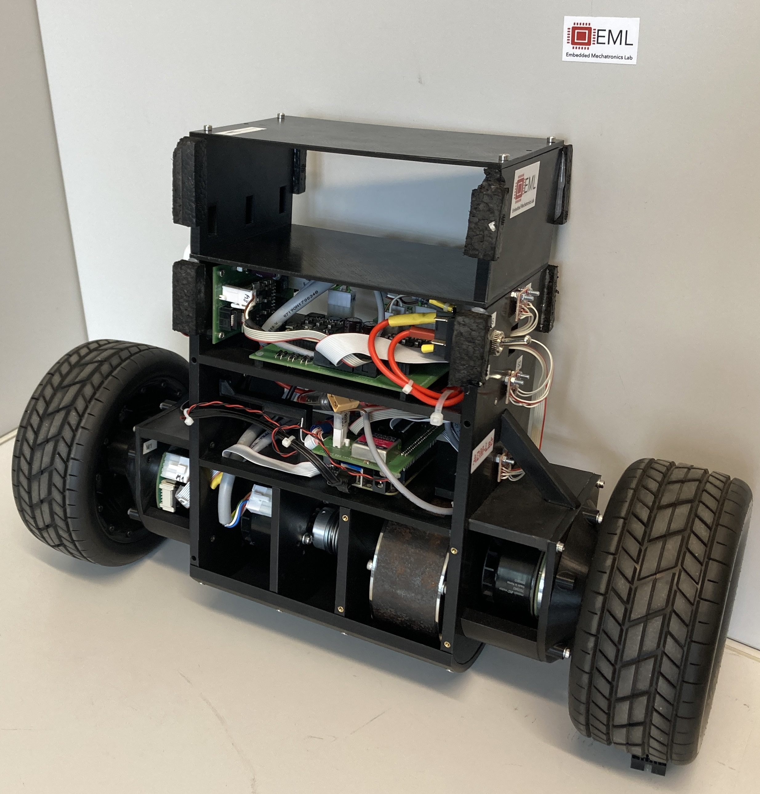

## The Challenging Bot Project! What is this about? 

- Open Source robotic test-bed for artificial motion learning developed at University of Applied Science in Karlsruhe
- low-cost, easy-to-use, easy-to-build
- Explanation of modelling, mechatronic design, feedback control, motion planning via RRT, motion learning via ILC
- all files attached!
  - CAD files, EAGLE files, list of components

/assets/img/chabo.JPG

../assets/img/chabo.JPG

../chabo.JPG

